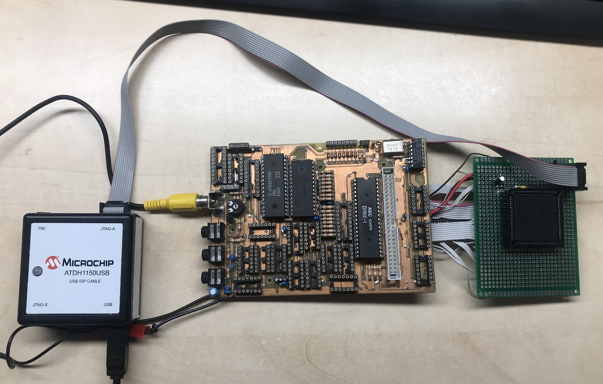
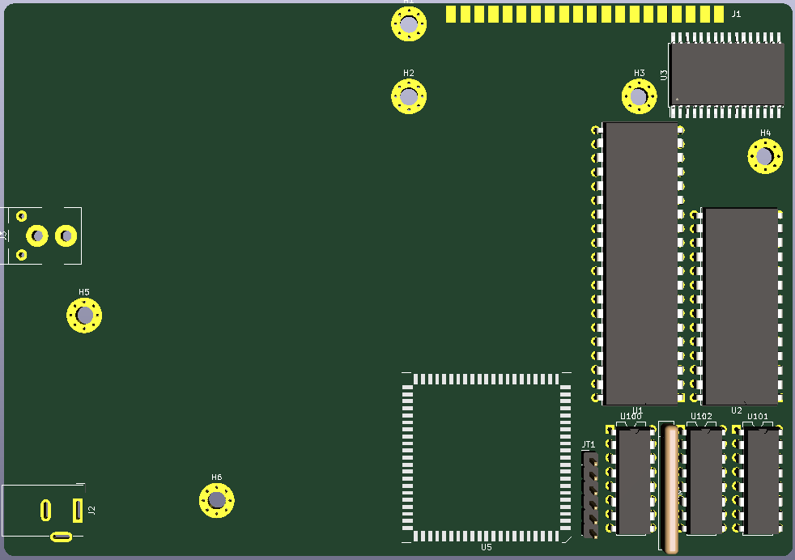
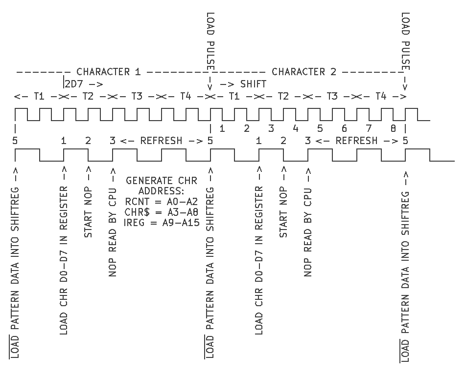
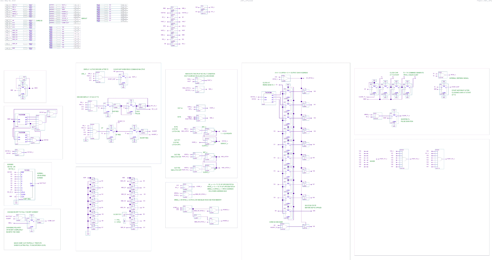
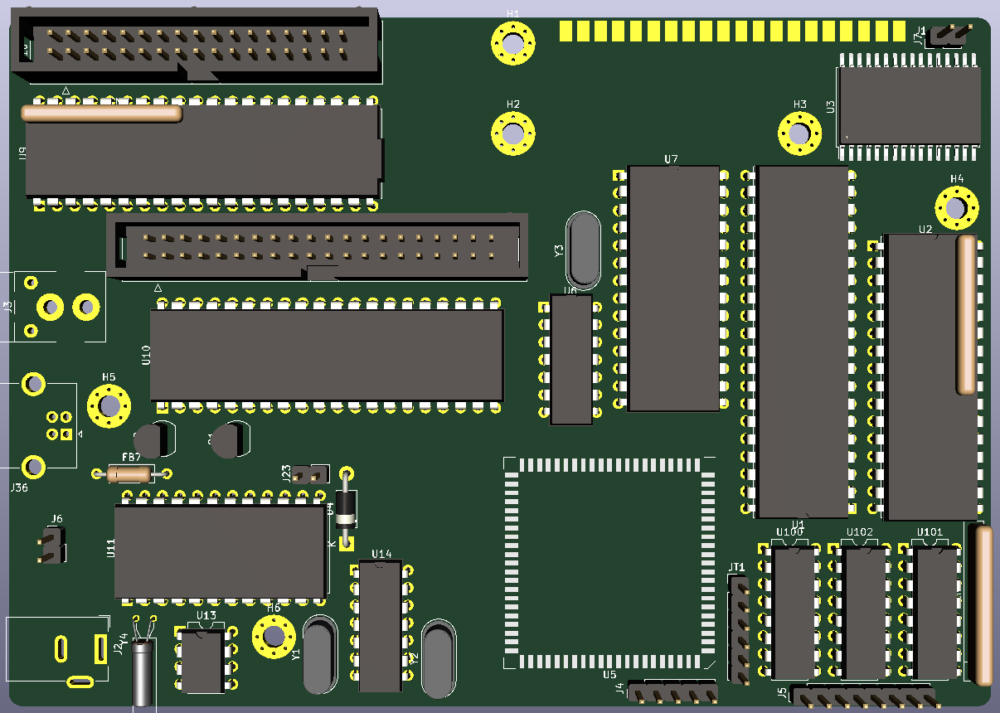
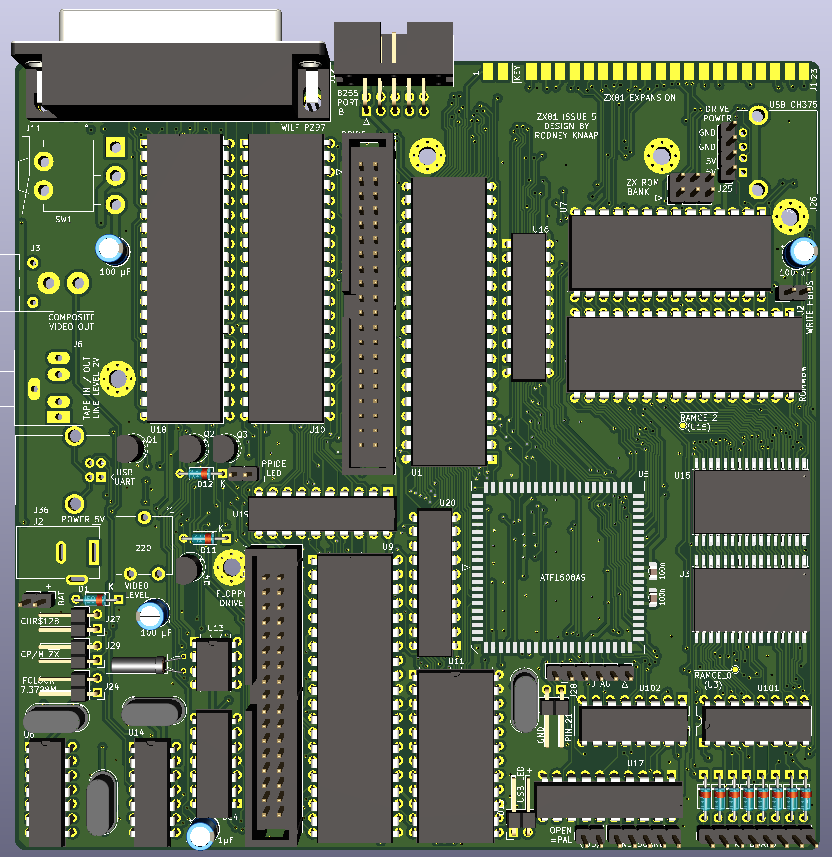
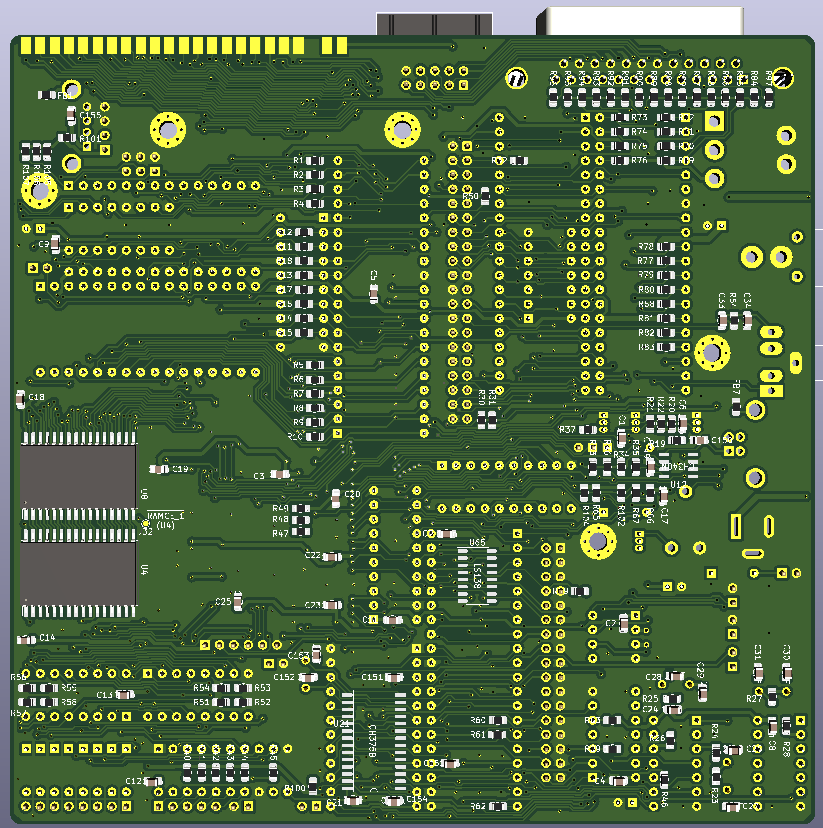

# ZX81-CPLD-V1
A ZX81 project based on CPLD technology, includes equivalent logic of ZX81 ULA functions based on ZX97Lite and combines ZX81 operation with ROMWBW compatible HBIOS and CP/M mode.

## Purpose and permitted use, cautions for a potential builder of this design
This project was created for historical purposes out of love for historical computing designs and for the purpose of enabling computing enthousiasts with a sufficient level of building and troubleshooting expertise to be able to experience the technology by building and troubleshooting the hardware described in this project.

Besides the GPL3 license there are a few warnings and usage restrictions applicable:
No guarantees of function or fitness for any particular or useful purpose is given, building and using this design is at the sole responsibility of the builder.

Do not attempt this project unless you have the necessary electronics assembly expertise and experience, and know how to observe all electronics safety guidelines which are applicable.

It is not permitted to use the computer built from this design without the assumption of the possibility of loss of data or malfunction of the connected device. To be used strictly for personal hobby and experimental purposes only. No applications are permitted where failure of the device could result in damage or injury of any kind.

If you plan to use this design or any part of it in new designs, the acknowledgement of the designer and the design sources and inspirations, historical and modern, of all subparts contained within this design should be included and respected in your publication, to accredit the hard work, time and effort dedicated by the people before you who contributed to make your project possible.

No guarantee for any proper operation or suitability for any possible use or purpose is given, using the resulting hardware from this design is purely educational and experimental and not intended for serious applications. Loss of data is likely and to be expected when connecting any storage device or storage media to the resulting system from this design, or when configuring or operating any storage device or media with the system of this design.

When connecting this system to a computer network which contains stored information on it, it is at the sole responsibility and risk of the person making the connection, no guarantee is given against data loss or data corruption, malfunctions or failure of the whole computer network and/or any information contained inside it on other devices and media which are connected to the same network.

When building this project, the builder assumes personal responsibility for troubleshooting it and using the necessary care and expertise to make it function properly as defined by the design. You can email me with questions, but I will reply only if I have time and if I find the question to be valid. Which will probably also lead to an update here. I want to primarily dedicate my time to new project development, I am not able to do any user support, so that's why I provide the elaborate info here which will be expanded if needed.

# Acknowledgements

This project was inspired by:
- Sinclair computers in the 1980s
- Wilf Rigter who helped me with my PCB designs in the 1990s
- the German ZX-Team who inspired me a lot by sending me their Magazin and kind letters and messages. Particularly Peter Liebert Adelt and Kai Fischer with whom I have had very pleasant and memorable contact in the 1990s years.
- Gary Kildall who invented CP/M, the concept of splitting the BIOS from software operation and so much more
- Wayne Warthen who created and manages the ROMWBW CP/M project development which is part of the basis of this project

# Concept of the project
Mostly in the 1990s I made some PCB designs for building your own ZX81. Since then I am also working on 286 PC based projects, preparing to create a 486 PC design without using any commercial chipset. After doing more advanced work on the 286 system, I had another look at my old projects, and plan to publish some of them in open source form.

My first idea is this project replacing all the glue logic of the ZX97 based design published by Wilf Rigter and merging all the logic into a CPLD chip. After a weekend of designing a CPLD project, soldering many wires, I have removed all the TTL ICs from my ZX81 Issue 4 project except the CMOS clock generator gates. 

After connecting the CPLD into the old PCB of my Issue 4 home etched prototype where I removed all the TTL ICs except the clock generator, I have now fully debugged the project. 

The CPLD is connected in a similar fashion as the Sinclair ULA chip, which means that the CPLD is only making use of the Dn lines and not the Dn' bus of the ZX81 based system. So this fact presented some issues where I needed to circumvent the NOP operations on the CPU which essentially were blocking access to character data on the Dn lines. I needed to get character data from the memory through the Dn lines and clock it into the character register. So I created a shift register to generate timing signals from the faster pixel clock. From the shift register outputs we can choose a precise instance in the CPU cycle to load the character data from memory. The ZX81/ZX97 memory is controlled in such a way that when the chip is selected, it also automatically outputs the data on the Dn' bus. And after that data is clocked into the character register first, the NOP signal is then immediately applied to the CPU so it will execute the well known NOP operations while the ZX81 video system works simultaneously. This modification turned out to be everything needed to operate the ULA functions on the CPU side of the databus. There was still a small problem with D6 and D7 from memory, but I got those bits by also clocking them at the same time with the character bits. The clocked data is then also fed back into the logic used to decode the NOP operation, on time in the same CPU cycle. 

So after debugging the timing, I was able to run the CPLD based ZX81 computer from the Dn databus only, and this frees up 8 more pins to be able to put these to good use for other functions for expanding the ZX81 computer. What I did was first to have the CPLD on both the Dn and Dn' bus, and then moving sections onto the Dn bus only, and solving the problems which were then occurring as described above. I did some tweaking of the serial video stream sync logic to line up the vertical lines a bit more straight, but for now I will wait with these kind of modifications when I have a decent PCB made so we will have the real impedance of all the traces and logic, and then I will look at what needs some tweaking in the CPLD, if any.

One of the next goals of this recent ZX81 work is to be able to run CP/M on this computer as an operating system. So we will need to be able to juggle the memory decoding around in order to exchange ROM for RAM and start CP/M. I am not a programmer(yet) so I will need to look into how we can load and run CP/M. Of course, running in memory is one thing, however doing more such as CP/M DOS operations on a harddisk or floppy drive, interacting with the user etc will require a console. CP/M will be better if we have more RAM available so bank switching logic needs to be included. This require some external TTL IC registers since the CPLD is not great in terms of how many register bits you can store inside it.

I have some ATF1508AS CPLD chips so this project is based on this CPLD type. We will directly solder the chip on the PCB for stability reasons. Sockets are really not so great for any computer because they are likely to introduce contact based malfunctions especially if we only can obtain low quality stuff these days.

---------------------------------------------
Update 26-4-2025 to REV0 quartus project zip:
- updated the polarity of character video stream, set default to ZX81 screen: black characters on white background
- connected ZX81 keyboard
- tested more extensively, wrote a few demo programs in BASIC
- tested on a CRT TV converted to monitor to check SYNC, LOAD and SAVE display if this is showing correctly, which it is
REV0 is now reasonably well tested

---------------------------------------------
Update 2-5-2025 to quartus package "002_ZX81_CPLD_CHR$128_WORKING@.zip":
- CHR$128 is fully working
- more elaborate I/O decoding (may be removed if this breaks some games)
- reworked the timing inside the CPLD according to Wilf Rigters ZX97 explanation
- done more work on analog tape input circuits to support safe line level amplitude loading of programs using the CPLD

According to Wilf explanation we have these timing instances:

1. Each character code (CHR$) byte in DFILE is addressed by the CPU PC, on
the
   rising edge T2 data is loaded from DFILE into the 74HC574 : bits 0-5
   and 7 into 7 bits.
2. On the falling edge of T2, the NOP circuit forces all CPU data lines to
zero.
3. On the rising edge of T3 the low data lines are interpreted by the CPU
   as a NOP instruction.
4. During T3/4, the CPU executes the Refresh cycle and ROM address lines are
   generated with I register on A9-A15, the CHR$ latch on A3-A8, and the
   ROW counter on address lines A0-A2.
5. On the rising edge of T1, pattern data from the EPROM is loaded into
   video shift register and 8 video pixels are shifted out at 6.5MHz
6. If bit 7 of the CHR$ latch equals 1, then the serial video data is
inverted. 
7. The CPU increments the program counter and fetches the next character
code. 
8. This repeats until a HALT is fetched. 
9. HALT opcode bit 6 = 1 and is therefore executed (no NOP). 
10. The SYNC timebase generates a HSYNC pulse independend of the CPU timing
and the ROW counter is incremented. 
11. The halted CPU continues to execute NOPs, incrementing register R and
   samples the INT input on the rising edge of each T4. 
12. When A6, which is hardwired to INT, goes low during refresh time,
   (bit 6 of the R reg = 0), the Z80 executes the INT routine (below 32K). 
13. CPU returns from INT and resumes "excution" of DFILE CHR$ codes. 
14. The process repeats 192 times and then INT routine returns to the main
   video routine, turns on the NMI latch and switches back to the
   application code. 
---------------------------------------------
The ZX81 CPLD quartus schematics are currently including CHR$128 support:

---------------------------------------------
Update 5-5-2025:
I have added CP/M memory management and the following devices (so far) to the PCB:
- 512KB ROM for ROMWBW HBIOS and CP/M
- 1MB of dedicated SRAM for running CP/M
- 128KB SRAM chip and 27C256 socket for the ZX81 RAM and ROM
- Floppy drive controller
- PPIDE interface
- ACIA serial commmunications adapter
- USB to Serial input for PC
- RTC chip Dallas

These devices all can be mapped into the ZX81 I/O map for future developers, including the RAM and bank switching memory currently used by CP/M
After confirming basic operation of the PCB, I will map all the devices in ZX81 mode and check that they don't interfere with the ZX81 operation

---------------------------------------------

---------------------------------------------

The CP/M environment is able to be controlled from a USB cable using any PC and terminal software like putty.
In the CP/M environment it's my intention to make a mechanism possible to load the ZX81 RAM contents, and then reset the system and switch back to running in ZX81 mode.
Possibly, ZX81 program development could be done from within the CP/M environment and this allows access to the ZX81 for testing. When switching back from CP/M to ZX81 mode, the ZX81 memory map is able to be fully featured using RAM only, shadowing the ZX81 ROM, which also allows for experimentation using modified or other ROM software in ZX81 mode.
Hopefully this could provide more freedom for experimentation in software and hardware.

---------------------------------------------

# Update 18-5-2025
The schematic and dual-layer PCB layout are now finished.  

Please refer to the files named ZX81_ISSUE_5_REV1 for the relevant information used to develop the design, which will include a copy of the quartus project used as a basis.  

Status of this design: development concept for manufacturing purposes only, unverified and under test/further development!  

My purpose is sharing my work openly with everyone who is interested, however I don't have time for doing interactive support for other builders who also like to repeat this work.  

I will share as much relevant and useful information as I am able to here in the project page.  
Don't build this unless you are confident of your own skills and debugging ability to be able to achieve this independently.  

For the ZX81 ROM we can use a standard 8KB ZX81 ROM as found on the internet. Placing three jumpers on J30 selects the lowest bank on the W27C512.  

  

A picture of the ZX81 Issue 5 PCB

---------------------------------------------

  

The reverse side of the PCB showing the bottom SMD components.
(The bottom silkscreen would cause the PCB manufacturing to be much more expensive, so I have created a PDF printout where the references and values are printed.
So the bottom printout has been optimized for this purpose, which will obscure some of the bottom silkscreen because in the PDF it is printed in the pad location for clarity.)

---------------------------------------------

Please note the following things: 
- the design set can be downloaded, please see all the files named "Issue5 REV 1" for the entire project set
- nothing is verified, if anyone builds this project they should only do this if they are confident to be able to solve any problems for themselves. After I have had time to build and verify this design myself I will update the relevant information here.
- the quartus project is a first draft which is in the current condition before any testing is done
- the quartus CPLD programming will be under development and subject to lots of changes after I build the REV1 PCB with the goal to develop a higher level of interaction between the ZX81 hardware and the CP/M operating system

I will confirm a version of quartus programming after I have a fully built PCB for testing and have had sufficient time to establish a certain level of basic functionality according to the initial design as created. 

After establishing a basic level of functionality and mode switching between ZX81 and CP/M mode, the functionality can be developed to a much higher degree. Since a CPLD is at the core of this computer, everything can be reprogrammed such as:
- supported devices connected in ZX81 mode
- IO port numbers can be chose separately in CP/M mode and ZX81 mode if needed
- memory paging system of ROMWBW could be extended into ZX81 mode support
- the 128KB SRAM used for ZX81 memory can be enabled with software development to support 128KB in ZX81 mode
- cycle decoding state machine could be created to differentiate between ZX81 video display generation and normal processing
- the state machine could then be used to switch the Z80 CPU to a higher clock speed in ZX81 mode

The idea is that we can boot CP/M using ROMWBW, and CP/M offers the operating system and file system. Software can be developed in CP/M to load the ZX81 RAM contents from a file in CP/M, and then mode switch back to ZX81 mode and run the software from there. A further plan is to be able to return to ZX81 mode after setting a register bit, which enables the entire Z80 memory map to be filled with the SRAM. The ROM section can be preloaded into RAM in order to use the ZX81 ROM code, or other custom code could be loaded instead of the ZX81 ROM.

A further development could be that we enable ROMWBW page mode memory in ZX81 mode as well. The entire 128KB ZX81 RAM is able to be page mapped if this is so desired, and these 8 16KB pages are all ZX81 display capable. If need be, we can also enable this with all other SRAMs on the board, which needs only to lift a few OE pins and connect them to the solder pads of the correct /RAMCE signals which are included on the PCB. I have not done this by default because it needs to be tested if this causes any problems with CP/M, which I don't expect. On the other hand, we could leave the ZX81 display memory page as-is and page map the rest of the Z80 memory range for any ZX81 program to use.

---------------------------------------------

A few updates of what has been verified in testing on the hand wired prototype to be fully functional:
- running the A6 to INT connection from within the CPLD
- using external transceivers for NOP and keyboard ports

---------------------------------------------

The PCB has been increased in size so we can fit more devices into the ZX81 case.
Please note: the space is very tight inside a ZX81. So we will need to verify and confirm that everything is able to fit and be connected as designed. Especially underneath the keyboard area for example, there is only limited height of components able to fit. Connecting the floppy drive flatcable may need some improvisation as well, for example.

---------------------------------------------

Further additions are now included:
- Wilf Rigter PZ97 port using a 8255 and parallel port connector and more
- tape save/load connector
- USB type B UART input connector using CH340N USB to serial chip
- power output header inside case
- PZ97 8255 Port B connects to separate header including power pins at back of case for custom I/O development
- CH375 universal USB controller chip added with a USB A socket at back right of the case
- CP/M RAM is now 1,5 MB
- CP/M ROM is 512KB, with jumper for updating from within CP/M
- ZX81 128KB SRAM is wired for full page mapping support depending on development and CPLD configuration for how this operates
- RESET of system is bidirectional on the CPLD, experimental and subject to testing first
- ZX81 ROM is 64KB W27C512 chip, which amounts to 8x the ZX81 ROM size, 3 jumper positions available on the PCB for selection of the ROM page
- tape I/O is now intended to be line level (2V amplitude) which has been verified for tape loading into the ZX81 using 2 stage transistor circuit to increase amplitude to full 5V for the serial tape load input. Save circuit will be tested and values/population of parts will be updated here.
- we have a FCLOCK input on the CPLD for providing a faster clock source for development purposes
- FCLOCK could be supplied with 7.3728MHz with a jumper or manually wired to 16MHz oscillator for FDC, for example

Because we have the CPLD, the entire system is able to be reconfigured in many ways, if needed. This is the goal of the entire schematic to enable as many reconfiguration options as possible in the system.

# Update 3-8-2025
I have taken one last look at the whole design before ordering the PCB and made a few additional changes. Because I wanted to be able to do more things which previously were not possible because of not having enough pins on the CPLD. I exchanged the CPLD type for a 100 pin package so this added a number of additional pins, with which I have made the following additions:
- the CPLD is now generating all memory chip selects. So the memory configuration is able to be completely changed. The external page register chips are still used because of CPLD register limitations.
- the CPLD now outputs MA14, MA15 and MA16 to the ZX RAM chip during ZX81 mode. This means that some form of memory page swapping would be possible within the 8 available 16KB pages that the ZX SRAM contains so theoretically the ZX81 mode could make use of 128KB of SRAM.
- the 1.5MB of CP/M memory would theoretically also be available for use in ZX81 mode if there is some application that could make use of this.
- the clock inputs now are expanded: we have 6.5MHz for ZX81 mode display generation, 7.3728MHz for CP/M mode of the Z80, and we have the FCLOCK input which could be connected with the onboard 16MHz clock for example.
- the clock output on the expansion port is now a separate output pin of the CPLD so basically anything is possible to be programmed to this output, so that even when the CPU is dynamically clocked, this output would be able to maintain the same clock speed throughout. Otherwise this pin could be used for custom designs on the expansion port as well since it's completely reprogrammable.
- a 555 timer is added on the PCB. This timer will supply a lower frequency pulse to the CPLD which can be used for various purposes, one of which will be a reset timer. A new RESET circuit will allow the CPLD to apply a suitable amount of RESET time to the whole computer whenever needed, for example after loading new data into the ZX81 RAM during CP/M mode so that the program can be automatically started.
- a speaker output has been added with a simple transistor output stage for driving a small speaker. This allows experimentation with sound such as generating tones and sound effects.
- the secondary floppy controller I/O decoder has been moved into the CPLD. This means that the floppy drive controller chip port addresses can be reconfigured to any port address, possibly replicating an existing floppy controller for the ZX81 for which software may exist, for example.  

Right now I am working on optimizing the traces in the new layout, and this will be the layout I am now going to upload to JLCPCB for manufacturing.
---------------------------------------------
  

---------------------------------------------
  

---------------------------------------------

# Future concepts and potential envisioned for this computer
After software has been developed for supporting various functions in ZX81 mode, all the hardware control in the computer is able to be updated in the CPLD for offering more and more devices to be used in ZX81 mode, which can be done at alternate IO ports in ZX81 mode if required to avoid conflicts with ZX81 operation. 

The ZX81 uses a Z80 as a CRT controller which is a brilliant design. This concept has the potential for providing CRT display for other purposes, and with this computer concept, there would be the idea to support the ZX81 display system and keyboard scanning routine within CP/M, thus creating a true CP/M console which makes use of the ZX81 display and keyboard. Which would be one of the coolest ideas of what we could do with this computer design. For realizing this, some CP/M BIOS driver code would be needed by developing this within the ROMWBW system using Z80 assembler. This is an advanced goal for this project. If anyone who is interested in this project feels capable to program such functions, please get in touch with me so we can plan to work on this together. I would be able to offer the CPLD reconfiguration necessary to provide initializing the ZX81 display in CP/M mode. We could use high resolution tricks used in ZX81 programs for generating a higher resolution console screen. Also a larger character set is possible using UDG. We could create an ASCII equivalent etc as needed.
If there is no interest, I will try to do some development myself, though I have a lot of hardware development scheduled in the near future first, see the other projects.

These ideas illustrate how much fun it can be to develop things on a ZX81, and that a ZX81 is able to be developed further into a much more functional computer which is able to provide more PC-alike level of operation thanks to CP/M. Using a ZX81 display and keyboard CP/M console would be an amazing concept to realize and a valuable addition for the ZX81 enthusiast community. I have also seen some interest in the RC2014 community where attempts have been made to add a ZX81 module to the system. This project may aid in this goal as well.

---------------------------------------------

A few items for the future:
- finding a CP/M developer interested in this project to create CP/M software and drivers to support the system
- performing tests with ZX81 mode enabled and disabled, testing if ZX81 can return in stable manner
- looking at autostarting basic version of ZX81 ROM as done by Wilf Rigter in his ZX97 so that a Z80 RESET will not erase the ZX81 RAM contents

---------------------------------------------

So please note: no prototype PCB has been built yet, so keep in mind the above warnings and remember that nothing is verified yet and this is the first revision of this new system design. I am sharing the designs in unverified state for providing interested readers an early look into the project. Deciding to build this please consider your skills and ability if you are confident to be able to do this yourself. Soldering should start with parts needed to be able to power up, erase and program the CPLD without any other parts, thus making sure that a recycled CPLD can not generate any contention with the other ICs and damage due to contention can be prevented. So any actual builder should plan such things carefully.
Next step could be to add the ZX81 parts, programming the CPLD and placing the ZX81 mode jumper. This is an initial test to verify the ZX81 components of the computer before adding the rest. See the schematic which can give clues to which parts are needed for creating the ZX81 operations.

Updates will follow as soon as I have ordered the PCB to be made and had the chance to build and test everything.

Kind regards,

Rodney
