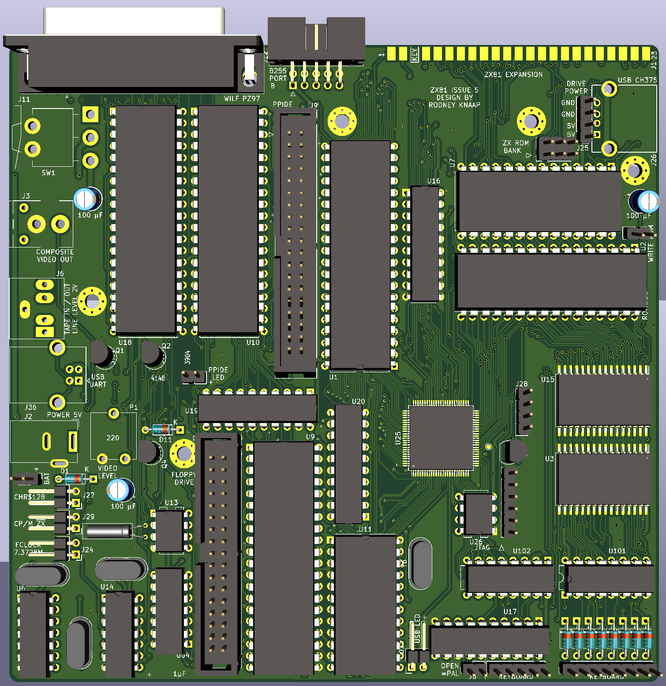
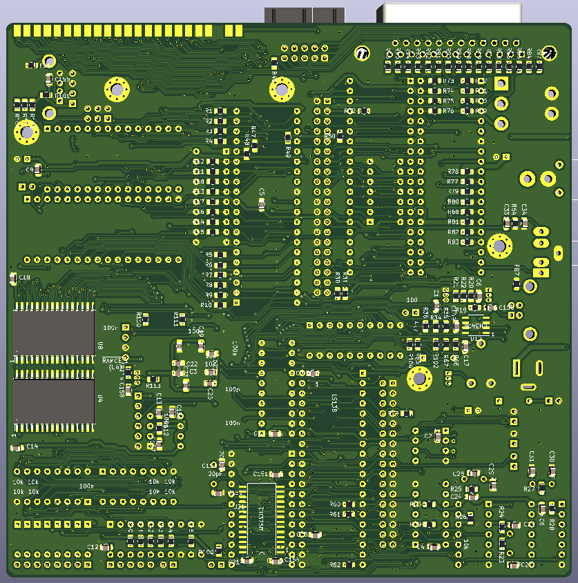

# ZX81-CPLD-V1 - ZX81 Issue 5 design  
A ZX81 project based on CPLD technology, includes equivalent logic of ZX81 ULA functions based on ZX97Lite and combines ZX81 operation with ROMWBW compatible HBIOS and CP/M mode.

## Purpose and permitted use, cautions for a potential builder of this design
This project was created for historical purposes out of love for historical computing designs and for the purpose of enabling computing enthousiasts with a sufficient level of building and troubleshooting expertise to be able to experience the technology by building and troubleshooting the hardware described in this project.

Besides the GPL3 license there are a few warnings and usage restrictions applicable:
No guarantees of function or fitness for any particular or useful purpose is given, building and using this design is at the sole responsibility of the builder.

Do not attempt this project unless you have the necessary electronics assembly expertise and experience, and know how to observe all electronics safety guidelines which are applicable.

It is not permitted to use the computer built from this design without the assumption of the possibility of loss of data or malfunction of the connected device. To be used strictly for personal hobby and experimental purposes only. No applications are permitted where failure of the device could result in damage or injury of any kind.

If you plan to use this design or any part of it in new designs, the acknowledgement of the designer and the design sources and inspirations, historical and modern, of all subparts contained within this design should be included and respected in your publication, to accredit the hard work, time and effort dedicated by the people before you who contributed to make your project possible.

No guarantee for any proper operation or suitability for any possible use or purpose is given, using the resulting hardware from this design is purely educational and experimental and not intended for serious applications. Loss of data is likely and to be expected when connecting any storage device or storage media to the resulting system from this design, or when configuring or operating any storage device or media with the system of this design.

When connecting this system to a computer network which contains stored information on it, it is at the sole responsibility and risk of the person making the connection, no guarantee is given against data loss or data corruption, malfunctions or failure of the whole computer network and/or any information contained inside it on other devices and media which are connected to the same network.

When building this project, the builder assumes personal responsibility for troubleshooting it and using the necessary care and expertise to make it function properly as defined by the design. You can email me with questions, but I will reply only if I have time and if I find the question to be valid. Which will probably also lead to an update here. I want to primarily dedicate my time to new project development, I am not able to do any user support, so that's why I provide the elaborate info here which will be expanded if needed.

# Acknowledgements

This project was inspired by:
- Sinclair computers in the 1980s
- Wilf Rigter who helped me with my PCB designs in the 1990s
- the German ZX-Team who inspired me a lot by sending me their Magazin and kind letters and messages. Particularly Peter Liebert Adelt and Kai Fischer with whom I have had very pleasant and memorable contact in the 1990s years.
- Gary Kildall who invented CP/M, the concept of splitting the BIOS from software operation and so much more
- Wayne Warthen who created and manages the ROMWBW CP/M project development which is part of the basis of this project

# Concept of the project
Mostly in the 1990s I made some PCB designs for building your own ZX81. Since then I am also working on 286 PC based projects, preparing to create a 486 PC design without using any commercial chipset. After doing more advanced work on the 286 system, I had another look at my old projects, and plan to publish some of them in open source form.

My first idea is this project replacing all the glue logic of the ZX97 based design published by Wilf Rigter and merging all the logic into a CPLD chip. After a weekend of designing a CPLD project, soldering many wires, I have removed all the TTL ICs from my ZX81 Issue 4 project except the CMOS clock generator gates. 

After connecting the CPLD into the old PCB of my Issue 4 home etched prototype where I removed all the TTL ICs except the clock generator, I have now fully debugged the project. 

The CPLD is connected in a similar fashion as the Sinclair ULA chip, which means that the CPLD is only making use of the Dn lines and not the Dn' bus of the ZX81 based system. So this fact presented some issues where I needed to circumvent the NOP operations on the CPU which essentially were blocking access to character data on the Dn lines. I needed to get character data from the memory through the Dn lines and clock it into the character register. So I created a shift register to generate timing signals from the faster pixel clock. From the shift register outputs we can choose a precise instance in the CPU cycle to load the character data from memory. The ZX81/ZX97 memory is controlled in such a way that when the chip is selected, it also automatically outputs the data on the Dn' bus. And after that data is clocked into the character register first, the NOP signal is then immediately applied to the CPU so it will execute the well known NOP operations while the ZX81 video system works simultaneously. This modification turned out to be everything needed to operate the ULA functions on the CPU side of the databus. There was still a small problem with D6 and D7 from memory, but I got those bits by also clocking them at the same time with the character bits. The clocked data is then also fed back into the logic used to decode the NOP operation, on time in the same CPU cycle. 

So after debugging the timing, I was able to run the CPLD based ZX81 computer from the Dn databus only, and this frees up 8 more pins to be able to put these to good use for other functions for expanding the ZX81 computer. What I did was first to have the CPLD on both the Dn and Dn' bus, and then moving sections onto the Dn bus only, and solving the problems which were then occurring as described above. I did some tweaking of the serial video stream sync logic to line up the vertical lines a bit more straight, but for now I will wait with these kind of modifications when I have a decent PCB made so we will have the real impedance of all the traces and logic, and then I will look at what needs some tweaking in the CPLD, if any.

One of the next goals of this recent ZX81 work is to be able to run CP/M on this computer as an operating system. So we will need to be able to juggle the memory decoding around in order to exchange ROM for RAM and start CP/M. I am not a programmer(yet) so I will need to look into how we can load and run CP/M. Of course, running in memory is one thing, however doing more such as CP/M DOS operations on a harddisk or floppy drive, interacting with the user etc will require a console. CP/M will be better if we have more RAM available so bank switching logic needs to be included. This require some external TTL IC registers since the CPLD is not great in terms of how many register bits you can store inside it.

---------------------------------------------  
# The ZX81 video display system  

According to Wilfs explanation we have these timing instances:  

1. Each character code (CHR$) byte in DFILE is addressed by the CPU PC, on
the
   rising edge T2 data is loaded from DFILE into the 74HC574 : bits 0-5
   and 7 into 7 bits.
2. On the falling edge of T2, the NOP circuit forces all CPU data lines to
zero.
3. On the rising edge of T3 the low data lines are interpreted by the CPU
   as a NOP instruction.
4. During T3/4, the CPU executes the Refresh cycle and ROM address lines are
   generated with I register on A9-A15, the CHR$ latch on A3-A8, and the
   ROW counter on address lines A0-A2.
5. On the rising edge of T1, pattern data from the EPROM is loaded into
   video shift register and 8 video pixels are shifted out at 6.5MHz
6. If bit 7 of the CHR$ latch equals 1, then the serial video data is
inverted. 
7. The CPU increments the program counter and fetches the next character
code. 
8. This repeats until a HALT is fetched. 
9. HALT opcode bit 6 = 1 and is therefore executed (no NOP). 
10. The SYNC timebase generates a HSYNC pulse independend of the CPU timing
and the ROW counter is incremented. 
11. The halted CPU continues to execute NOPs, incrementing register R and
   samples the INT input on the rising edge of each T4. 
12. When A6, which is hardwired to INT, goes low during refresh time,
   (bit 6 of the R reg = 0), the Z80 executes the INT routine (below 32K). 
13. CPU returns from INT and resumes "excution" of DFILE CHR$ codes. 
14. The process repeats 192 times and then INT routine returns to the main
   video routine, turns on the NMI latch and switches back to the
   application code.  
---------------------------------------------
Initial CPLD block design schematic example used for testing purposes, including CHR$128 support:

---------------------------------------------  
# Feature list:  
- internal power switch
- 512KB ROM for ROMWBW HBIOS and CP/M
- 1,5MB of dedicated SRAM for running CP/M
- ZX81 ROM is 64KB W27C512 chip, which amounts to 8x the ZX81 ROM size, 3 jumper positions available on the PCB for selection of the ROM page
- 128KB SRAM chip supporting ZX81 display, MA14, MA15 and MA16 on the ZX RAM are possible to be generated with the CPLD to support memory paging operation, swapping 16KB pages of RAM
- all of the memory chip enables are output by the CPLD so these are reconfigurable
- HD floppy drive controller (freely configurable port addresses of the FDC chip in ZX81 mode and CP/M mode)
- PPIDE interface
- ACIA serial commmunications
- USB to Serial CP/M console input for PC connects with the ACIA
- serial RTC chip Dallas
- Wilf Rigters PZ97 port using a 8255 and parallel port connector
- PZ97 8255 Port B connects to separate header including power pins at back of case for custom I/O development
- power output header inside case for powering drives
- CH375 universal USB controller chip with a USB A socket at back right of the case
- tape I/O at line level, 2V amplitude ZX81 tape loading using a 2 stage transistor circuit, fully verified
- FCLOCK input on the global clock input pin of the CPLD for providing a faster clock source for development purposes
- 7.3728MHz oscillator connected to CPLD input for CP/M mode standard clock frequency
- 16MHz oscillator for FDC could be supplied to FCLOCK with a jumper for clocking the CPU or other circuits at higher speeds
- NE555 timer onboard, generates low frequency timing pulses
- self RESET function present in the CPLD, RESET period will be defined by choosing NE555 timer RC component values
- clock pulse to the expansion connector is able to be generated completely independently from the CPU clock to support any type of expansion clock speed
- separation resistors on ZX81 ROM and RAM chip enable signals allow external disabling of ZX81 memory if needed
- speaker output pin present on CPLD using a transistor output stage, supports sound experimentation and development by connecting a speaker

Any hardware currently on the PCB is also possible to be used directly in ZX81 mode if so configured inside the CPLD.

Status of this design: development concept for manufacturing purposes only, unverified and under test/further development. 
PCB is ordered from JLCPCB. (3-8-2025)

---------------------------------------------

# CP/M  

For further information about CP/M, please refer to the RC2014/ROMWBW project. 
The CP/M environment is able to be controlled from a USB cable using any computer with USB ports and terminal software like putty.

In the CP/M environment it's my intention/idea to make a mechanism possible to load the ZX81 RAM contents, and then reset the system and switch back to running in ZX81 mode.
In ZX81 mode, the software in memory is then executed starting from the Z80 exiting the RESET state.

Possibly, ZX81 program development could even be done from within the CP/M environment and this allows direct access to the ZX81 for testing. When switching back from CP/M to ZX81 mode, the ZX81 memory map would for example be able to be fully featured using RAM only, shadowing the ZX81 ROM, which also allows for experimentation using modified or different ROM software in ZX81 mode. Hopefully this could provide more freedom for experimentation in software and hardware.

---------------------------------------------

My purpose is sharing my work openly with everyone who is interested, however I don't have time for doing interactive support for other builders who also like to repeat this work.  

I will share as much relevant and useful information as I am able to here in the project page.  
It is advised to build this project only if you are confident of your own skills and debugging ability to be able to achieve this independently.  

For the ZX81 ROM we can use a standard 8KB ZX81 ROM file as found on the internet. Placing three jumpers on J30 selects the lowest bank on the W27C512.  
I will look at the autostart function how to modify the ZX81 ROM to allow the ZX81 to come out of RESET and not erasing the RAM.

Please note the following things: 
- the design files can be downloaded, please see all the files named "Issue5 REV 1D" for the latest version of the entire project set
- nothing is verified yet, if anyone builds this project they should only do this if they are confident to be able to solve any problems for themselves.
After I have had time to build and verify this design myself I will update the relevant information here.
- the quartus project is only a first draft before any testing and development is done
- the quartus CPLD programming will be under development and subject to lots of changes for a certain period after I build the REV1D PCB. I will update information about the test and development findings here at the bottom of the page.

---------------------------------------------
  

---------------------------------------------
  

---------------------------------------------

I have seen some interest in the RC2014 community for the ZX81 where attempts have been made to add a ZX81 module containing a ZX81 ULA to the system, the status of that work is not clear at the moment. I will try to find out more information about this.

---------------------------------------------  
# 3-8-2025: PCB has been ordered from JLCPCB  

After receiving the PCB I will work on assembly and testing.
I will document the assembly and programming process here so it could possibly be repeated by enthusiasts who are able to do this type of work with the information I am providing here.

Kind regards,

Rodney
